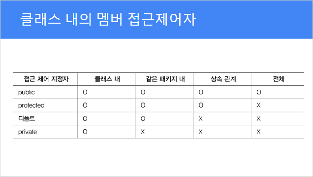

# Static(전역) 변수
## 메모리 사용방식
### 위에 적혀있는 영역일수록 상위공간
- Data에 모든 공간에서 활용되는 Static 변수 저장.
- Stack에 함수와 그 함수 내에서 사용하는 local 변수 저장.
- Heat에는 Stack에서 다른 클래스를 불러왔을 때 그 클래스의 변수를 저장.  
Heat에 저장된 변수들을 object(객체)라고 한다.
## 활용방법
### 학생들을 기록할 때 count는 학생의 수
```java
public class StaticVar {
	// 학생들의 정보를 저장할 변수들을 생성
	String name;
	int score;
	// Static 변수 count 생성
	static int count = 0;
}
```
```java
public class StaticTest {
	public static void main(String[] args) {
		StaticVar sv1 = new StaticVar();
		sv1.name = "홍길동";
		sv1.score = 90;
		// sv1.count = 1;
		// static 변수를 사용하게 된다면 아래처럼 사용.
		StaticVar.count++; // StaticVar.count 0 - > 1

		// 학생들을 추가로 기록할 때
		StaticVar sv2 = new StaticVar();
		sv2.name = "김나나";
		sv2.score = 70;
		StaticVar.count++; // StaticVar.count 1 - > 2
	}
}
```

# Method overloading
## 함수 여러개를 하나의 함수로 정의하는 방법
- 자바는 변수의 타입을 정해야 하기 때문에  
add함수의 변수타입을 int로 설정할 경우에는 실수를 더할 수 없다.
  
- overloading을 사용한다면 변수를 double로 사용하는 함수를  
하나 더 만들어서 add함수에 덮어 씌울 수 있다.

## 활용방법
- 함수를 사용할 때 사용하는 매개변수에 따라 그 상황에 맞는 함수가 실행된다.
```java
public class Add {
	int add(int a, int b){
		return a + b;
	}
	
	double add(double a, double b){
		return a + b;
	}
	
	double add(int a, double b){
		return a + b;
	}
	
	double add(double a, int b){
		return a + b;
	}
	
	int add(int a, int b, int c) {
		return a + b + c;
	}

	String add(String a, String b) {
		return a + " " + b;
	}
}
```

# Constructor(생성자)
- 눈에 안 보이지만 기본적으로 Member()라는 생성자는 만들어져 있었다.  
따라서 지금까지 에러 없이 잘 사용해왔다.
  	
- 이제는 파라미터가 있는 생성자가 필요하다.  
기본적으로 제공하는 것이 아니므로, 우리가 만들어줘야 한다.  
- 단, 생성자는 리턴타입이 없다.(void X)  
생성자 함수 이름은 클래스 이름고 같다.
  
- 생성자를 수동으로 만들 경우  
기존에 기본적으로 제공한 Member() 생성자는 사라진다.  
따라서 이 생성자를 활용하려면 직접 써줘야 한다.
  
- Method overloading하는 경우가 많다.

## 활용방법
```java
public class Member {

	String name;
	String tel;
	String address;
	
	Member(String name, String tel, String address){
		// 이 클래스의 name = 파라미터로 받은 name;
		this.name = name;
		this.tel = tel;
		this.address = address;
	}

	Member(){	
		// method overloading한 함수(생성자)		
	}
	
	Member(String name, String tel){
		// 이 클래스의 name = 파라미터로 받은 name;
		this.name = name;
		this.tel = tel;
	}
	
	void print() {
		System.out.println(name);
		System.out.println(tel);
		System.out.println(address);
	}
}
```
```java
public class MemberTest {

	public static void main(String[] args) {
		// Constructor는 생성자라는 뜻.
		
		// 1. 메모리 공간 확보
		Member m1 = new Member();
		
		// 2. 데이터 저장
		m1.name = "홍길동";
		m1.tel = "010-1234-5678";
		m1.address = "인천광역시 서구";
		
		Member m2 = new Member();
		m2.name = "김나나";
		m2.tel = "010-2222-3333";
		m2.address = "인천광역시 연수구";
		m1.print();
		
		// 한줄에 이름, 전화번호, 주소를 한번에 편하게 저장하기
		// 이 때 Constructor 이용
		// 여태 사용한 new 뒤에 있던 클래스()들이 전부 Constructor(생성자)
		Member m3 = new Member("철수", "010-4444-5555", "서울시 강서구");
		m3.print();
		
		// 주소는 옵셔널 데이터라 안 받을 수도 있다.
		// 따라서, 이름과 전화번호만 바로 저장할 수 있는 생성자 만들기.
		Member m4 = new Member("영희", "010-5555-6666");
		m4.print(); // 주소는 null로 출력
	}
}
```
# 접근제어자(Access)
- 접근제어자란 다른 클래스에서 이 클래스의 멤버변수나 메소드를  
이용할 수 있도록 열어주거나 닫아주는 역할을 하는 것.

## 키워드

- 아무것도 안 적는 것 => default: 같은 패키지에서만 접근가능.
- public: 다른 클래스 어디에서건 이 클래스의 멤버변수와 메소드에 접근가능.
- private: 다른 클래스 어디에서건 이 클래스의 멤버변수와 메소드에 접근 아예 불가.
- protected: 상속 배우고 배울 예정.

## 활용방법
- 패키지가 다른 두 클래스를 이용하기.
- main함수가 있는 클래스에서 'import 패키지명.클래스명;'을 한 뒤에 클래스를 이용한다.
- 이용하는 클래스의 변수를 public으로 하거나 public함수를 이용해서 변수를 사용한다.

```java
package model;

public class Member {
	// private는 다른 클래스에서 사용하지 못하도록 함.
	// public함수를 통해 다른 클래스에서 활용하는 것은 가능.
	
	// private가 없더라도 public이 없다면 같은 패키지의 클래스에서는 사용가능하나,
	// 다른 패키지의 클래스에서는 사용 못함.
	// 이것도 마찬가지로 public함수를 통해 활용가능.

	private String name;
	String tel;
	String address;

	public void setData(String name, String tel, String address){
		this.name = name;
		this.tel = tel;
		this.address = address;
	}
	
	public void print(){
		System.out.println(name + ", " + tel + ", " + address);
	}
	public Member(String name, String tel, String address) {
		this.name = name;
		this.tel = tel;
		this.address = address;
	}
	// 메인함수의 클래스와 패키지가 다를 땐 기본생성자가 public Memver()로 생성됨.
	public Member(){

	}
}
```
```java
package main;

// 패키지(폴더)가 다른 파일에 있는 것을 사용하려면 import 해야 함.
import model.Member;

public class MemberTest {

	public static void main(String[] args) {
		
		Member m1 = new Member();
		m1.setData("홍길동", "010-1234-5678", "인천시 서구");
		m1.print();
		
		// 생성자로 바로 데이터 저장까지 할 수 있도록 개발!
		Member m2 = new Member("김나나", "010-2222-3333", "인천시 연수구");
		m2.print();

		m2.setTel("010-3333-4444");
		m2.print();
	}
}
```

# extends(상속)
- Parent(부모) class: 상속을 하는 클래스.
- Child(자식) class: 상속을 받는 클래스.
  
- 여러 클래스를 만들 때, 중복된 요소가 많다면
클래스를 상속 받아 만든다.

## 활용방법
- name, age, money를 상속하는 코드
```java
package model;
public class Parent {

	public String name;
	public int age;
	// 머니는 private 설정 => 상속은 받는다!
	// 프라이빗은 노출을 안 하겠다는 의미!
	private int money;
	
	public Parent() {
		System.out.println("부모 생성자 호출됨.");
	}
	
	public void print() {
		System.out.println(name);
		System.out.println(age);
		System.out.println(getMoney());
	}

	public int getMoney() {
		return money;
	}

	public void setMoney(int money) {
		if (money < 0) {
			this.money = 0;
		} else {
			this.money = money;
		}
	}
}
```

```java
package model;
public class Child extends Parent{
	// Child 클래스에도 set money와 get money가 생김.

	// 상속받는 변수 + hobby 변수
	public String hobby;

	public Child() {
		System.out.println("자식 생성자 호출됨.");
	}
	public void printChild(){
		System.out.println(name);
		System.out.println(age);
		System.out.println(getMoney());
		System.out.println(hobby);
	}
}
```
```java
package main;
import model.Parent;
import model.Child;
public class Main {

	public static void main(String[] args) {

		Parent p = new Parent();
		
		p.name = "홍길동";
		p.age = 50;
		p.setMoney(1000000000);
		
		p.print();
		
		Child c = new Child();
		
		c.name = "김나나";
		c.age = 23;
		c.setMoney(100000000);
		c.hobby = "게임";
		
		// c의 데이터를 출력;
		c.printChild();
	}
}
```
